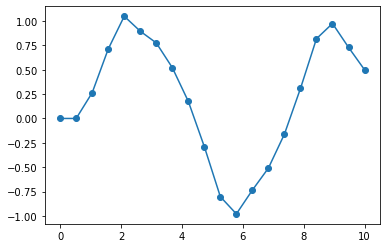

Esta parte de la documentación del proyecto se centra en un Enfoque orientado a los problemas. Afrontarás tareas que podrías resolver, con la ayuda del código en este proyecto.

## ¿Como iniciar?
descargue el codigo del repositorio de este github en el mismo directorio que tu script de python.

    tu_proyecto/
    │
    ├── metodos/
    │   ├── __init__.py
    │   └── metodos_numericos.py
    │
    └── tu_script.py

Dentro de `tu_script.py` ahora puedes importar las funciones como: `euler()` funcion de `metodos.metodos_numericos`
module:

    # tu_script.py
    from metodos.metodos_numericos import euler
   
Después de importar la función, se puede usar agregando una ecuacion a evaluar, la x inicial y un np.array.

	# tu_script.py
	from metodos.metodos_numericos import euler
	def ecu(x,t):
		return (-x)**3 + np.sin(t)
	t = np.linespace(0,10, 20)
	x = euler(ecu, 0, t)
	
Asi obtienes los valores de x

Si quisieras graficar la EDO podrias cambiar tu codigo de la siguiente forma::

	# tu_script.py
	from metodos.metodos_numericos import euler
	import matplotlib.pyplot as plt
	def ecu(x,t):
    		return (-x)**3 + np.sin(t)
	t = np.linspace(0,10, 20)
	x = euler(ecu, 0, t)
	plt.plot(t, x, '-o')
	plt.show()
y asi obtener un grafico como este: 

